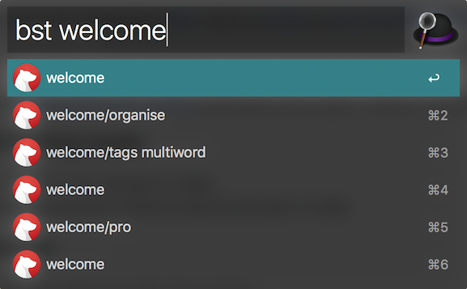
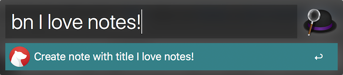
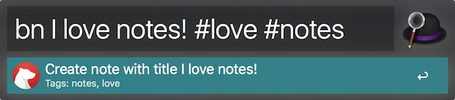

# Bear Alfred Workflow

[Alfred workflow](https://www.alfredapp.com/workflows/) to search and create notes in [Bear](http://www.bear-writer.com/). View it on [Packal](http://www.packal.org/workflow/bear), or [join in the discussion on the Alfred forums](https://www.alfredforum.com/topic/10403-bear-workflow-search-and-create-notes/).

## Install
To install, download a [released alfred-bear workflow](https://github.com/chrisbro/alfred-bear/releases/download/0.3.5/alfred-bear.alfredworkflow) and double-click to open in Alfred. Easy-peasy.

## Searching and opening results 
`bs` -- Search for a note by title/content and open it in Bear.

`bst` -- Search for a tag (a group of notes) by tag title and open it in Bear.

## Creating a new note
`bn I love notes!` -- Creates a new note with the title and text "*I love notes!*"

`bn I love notes! #love #notes` -- Creates a new note with the title and text "*I love notes!*" and the tags "*#love*" and "*#notes*"

## Known Issues
- Creating tags only works with single-word tags - multiword tags hopefully to come.

## Todo
- Append text to existing notes.
- Figure out multi-word tags.

## Thanks
- [deanishe](https://www.alfredforum.com/profile/5235-deanishe/) for guidance on Alfred workflow creation and capabilities, and for his excellent [Python workflow library](http://www.deanishe.net/alfred-workflow/index.html).
- [dfay](https://www.alfredforum.com/profile/3468-dfay/) for guidance from his experience writing the [Ulysses Alfred workflow](https://github.com/robwalton/alfred-ulysses-workflow).
- [Rhyd Lewis](https://github.com/rhydlewis) for giving me an excellent example to work off of in his [Omnifocus Alfred workflow](https://github.com/rhydlewis/search-omnifocus).

## Versions
### 0.3.5
* Fixed backwards compatibility with Alfred 3, sorry about that.

### 0.3.4
* Fixed 'bst' calls that were failing due to schema change. Again. The SQL schema change sequel, if you will.

### 0.3.3
* Fixed 'bst' calls that were failing due to schema change

### 0.3.2
* Fixed database location that changed with a Bear update. Again.

### 0.3.1
* Fixed database location that changed with a Bear update.

### 0.3.0
* Added search results from note text to main search.

### 0.2.2
* Changed search queries to order by last modified date descending, so that more recently modified notes/tags show up at the top.

### 0.2.1
* Added hashtag symbol to "Open Tag" list results to make it a little more obvious that it's a tag and not a note.

### 0.2.0
* Now allows non-ASCII characters.
* Searching by tag now displays not only tags that match the search query, but notes that match those tags as well.
* Searching by tag now works with *or* without the '#' symbol in front of the tag.

**0.1.0** 
Initial public release.